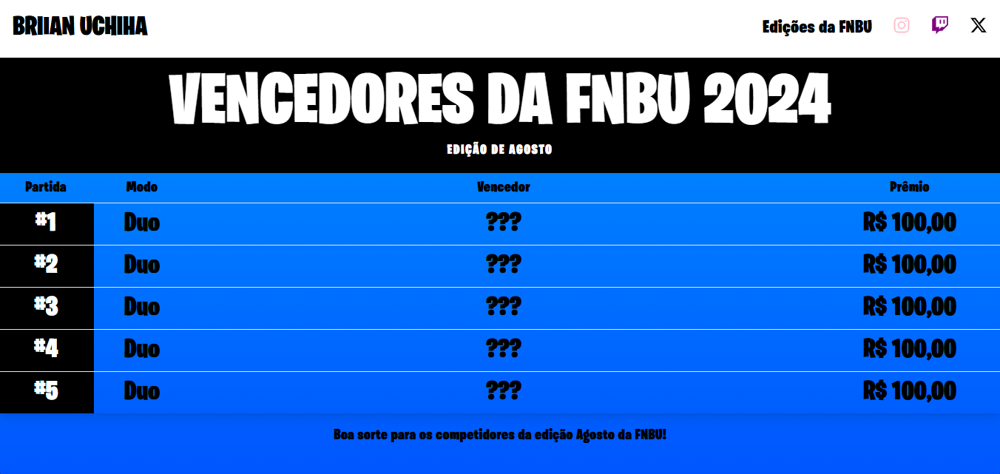

This is a [Next.js](https://nextjs.org/) project bootstrapped with [`create-next-app`](https://github.com/vercel/next.js/tree/canary/packages/create-next-app).

## Running the client

First, open the terminal and then access both fnbu-client and fnbu-server folder in different terminals, then install the project dependencies:

```bash
npm install
```

Now, use the following command to run the development version of the project:

```bash
npm run dev
```

The server will run on the port 5000 and the client on the port 3000.
Open [http://localhost:3000](http://localhost:3000) with your browser to see the result.

The website should look like this:


